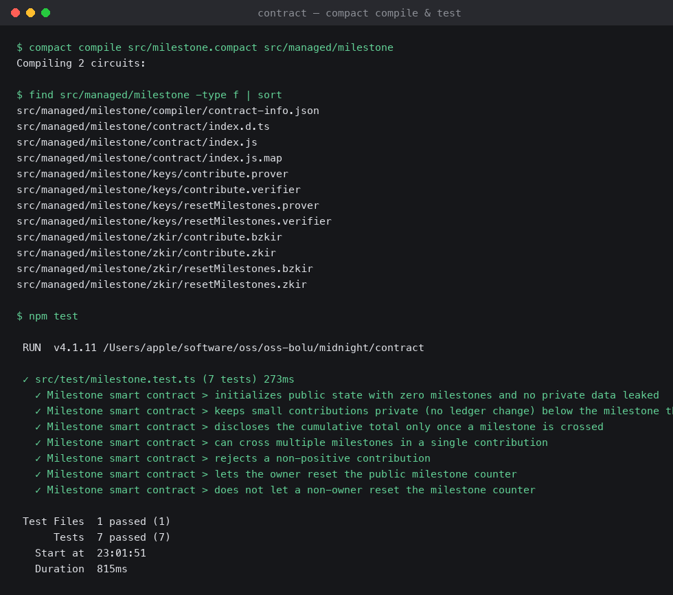
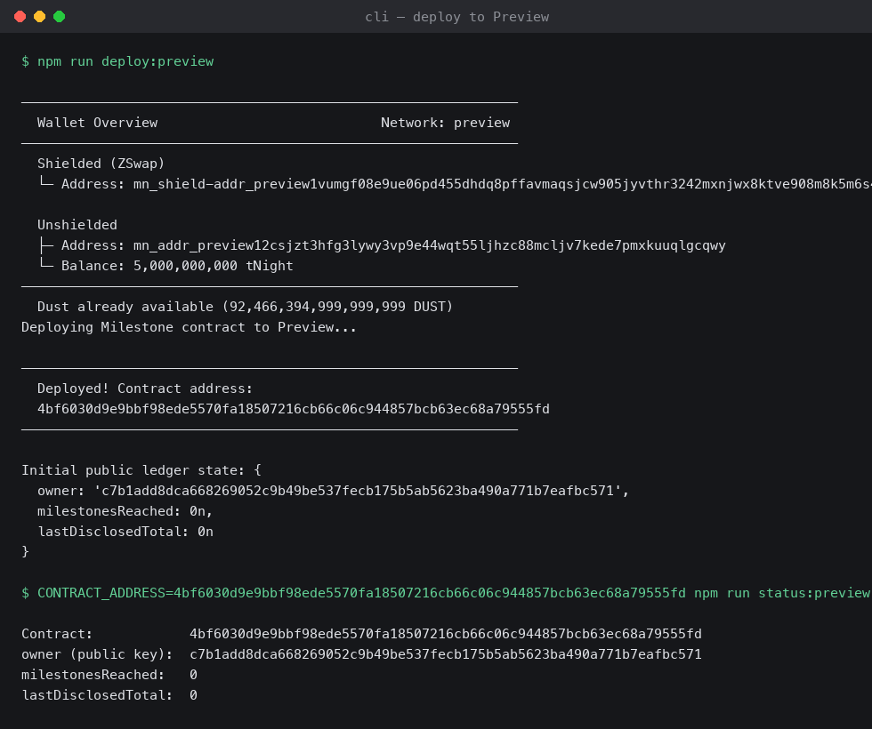

# Milestone — a private-contribution counter on Midnight

## Product idea

Milestone is a minimal privacy-preserving fundraising/progress tracker built
with Compact. Contributors submit amounts privately — no one, not even the
chain, ever sees an individual contribution — but the *moment* the running
total crosses a milestone (every 100 units), that cumulative total is
deliberately disclosed on-chain and the public milestone counter ticks up.
It's a small, concrete illustration of the core Midnight pattern: keep
sensitive inputs private by default, and only reveal exactly the aggregate
fact the application actually needs the world to see — nothing more.

## Deployed contract

- Network: **Preprod** — TODO: fill in the address here after running `npm run deploy:preprod`
- Verify independently at any time (no wallet needed, reads the indexer directly):
  ```bash
  CONTRACT_ADDRESS=<address> npm run status:preprod
  ```

A deployment also exists on **Preview**:

- Contract address: [`4f1ceaaf29f739fa140df1cf71397df3d5fd917cade9d6a38d86699c1873dd19`](https://preview.midnightexplorer.com/contracts/4f1ceaaf29f739fa140df1cf71397df3d5fd917cade9d6a38d86699c1873dd19) — view live on Midnight Explorer
  ```bash
  CONTRACT_ADDRESS=4f1ceaaf29f739fa140df1cf71397df3d5fd917cade9d6a38d86699c1873dd19 npm run status:preview
  ```

## Live demo

`TODO: link once deployed to Vercel/Netlify — see frontend/ for the build to deploy.`

## Demo video

`TODO: link a short recording of wallet connect + a successful contribute() call.`

## Submission checklist

- [x] Midnight.js SDK + DApp Connector API — `frontend/src/midnight/`
- [x] Lace connect / disconnect — `frontend/src/midnight/dappConnector.ts`,
      wired into the UI via `WalletBar`
- [x] Circuit called from the frontend, result handled — `contribute()` in
      `frontend/src/midnight/contract.ts`, called from `ContributeForm`
- [x] Observable privacy behavior — see "Observable privacy behavior" below
- [x] Local private state managed client-side — IndexedDB via
      `levelPrivateStateProvider`, see "Frontend" section below
- [ ] Contract deployed to Preprod with a verifiable address — see
      "Deployed contract" above (TODO once `npm run deploy:preprod` is run)
- [ ] Live demo link (Vercel/Netlify) — see "Live demo" above
- [ ] Demo video (wallet connect + successful circuit call) — see "Demo
      video" above
- [x] Minimum 8 meaningful commits — `git log`

## Public state vs. private witness

Compact splits contract data into two worlds that never mix unless you say
so explicitly:

- **Public ledger state** (`contract/src/milestone.compact`): `owner`,
  `milestonesReached`, and `lastDisclosedTotal` are declared with `export
  ledger`. These are readable by anyone querying the chain — that's the
  entire point of putting them there.
- **Private witness state**: the caller's `secretKey` and their running
  `hiddenTotal` never appear in the ledger. They live only in the caller's
  local private state (see `contract/src/witnesses.ts`), and are supplied to
  circuits via `witness` declarations (`localSecretKey`, `addToHiddenTotal`).
  The compiler enforces this — any attempt to write a witness-derived value
  to the ledger without wrapping it in `disclose()` is a **compile error**.

The `contribute` circuit shows the boundary in action: it computes
`newTotal` from a private witness, but only calls `disclose(newTotal)` (and
increments the public counter) once that total crosses the next milestone
threshold. Every contribution below the threshold leaves zero trace on
chain — not the amount, not even the fact that a contribution happened.
`resetMilestones` shows the same pattern for authorization: the owner proves
they know the secret key behind `owner` without ever revealing that key.

## Repo layout

```
contract/          Compact contract, generated managed/ output, tests
  src/milestone.compact
  src/witnesses.ts       private-state shape + witness implementations
  src/managed/milestone/ generated circuits, zkir, and prover/verifier keys
  src/test/               vitest suite against a local simulator
cli/                Node-based deployment tooling (Preview + Preprod)
  src/deploy-{preview,preprod}.ts   build/fund a wallet, deploy, print address
  src/contribute-{preview,preprod}.ts  call contribute() from the CLI
  src/join-{preview,preprod}.ts     read back public state, no wallet needed
  proof-server.yml       docker compose for the local proof server
frontend/           Browser DApp — Lace wallet connect + circuit calls
  src/midnight/       DApp Connector ↔ midnight-js bridge (see below)
  src/hooks/useMidnight.ts  connect/disconnect/create/join/contribute state
  src/components/     wallet bar, milestone switcher, progress, contribute form
screenshots/        compile + deploy output
```

## Setup — run it locally

Prerequisites: macOS/Linux, [Docker](https://www.docker.com/), Node.js 22.

1. **Install the Compact toolchain** (compiler + CLI):
   ```bash
   curl --proto '=https' --tlsv1.2 -LsSf https://raw.githubusercontent.com/midnightntwrk/compact/main/install.sh | sh
   compact update            # fetches the latest compactc release
   compact --version
   ```
2. **Use Node 22**:
   ```bash
   nvm install 22 && nvm use 22
   ```
3. **Install dependencies** (npm workspaces cover `contract/`, `cli/`, and `frontend/`):
   ```bash
   npm install
   ```
4. **Compile the contract** — regenerates `contract/src/managed/milestone/`
   (circuits, zkir, prover/verifier keys):
   ```bash
   cd contract && npm run compact
   ```
5. **Run the test suite** (contract logic against an in-memory simulator,
   no network needed):
   ```bash
   npm test
   ```
6. **Start the local proof server** (needed for CLI deploys — the frontend
   instead delegates proving to Lace itself, no local server required):
   ```bash
   cd ../cli && npm run proof-server   # docker compose, listens on :6300
   ```
7. **Deploy**, in a second terminal — `preview` or `preprod`:
   ```bash
   npm run deploy:preview   # or: npm run deploy:preprod
   ```
   With no `WALLET_SEED` set, this generates a fresh wallet and contract
   owner key, prints the wallet's unshielded address, and waits for you to
   fund it from the network's faucet
   ([Preview](https://faucet.preview.midnight.network/) /
   [Preprod](https://faucet.preprod.midnight.network/)) before deploying.
   **Save the printed seed and owner secret key** — the owner key is
   required to later call `resetMilestones`. To reuse an existing wallet on
   a later run:
   ```bash
   WALLET_SEED=<hex seed> OWNER_SECRET_KEY=<hex key> npm run deploy:preprod
   ```
8. **Check a deployed contract's public state** at any time:
   ```bash
   CONTRACT_ADDRESS=<address> npm run status:preview
   ```

## Frontend — Lace wallet DApp

`frontend/` is a Vite + React app that connects to Lace via the [DApp
Connector API](https://docs.midnight.network/api-reference/dapp-connector)
(`@midnight-ntwrk/dapp-connector-api`) and calls the same contract as the
CLI, from the browser. Connecting a wallet loads a well-known demo contract
by default (`VITE_CONTRACT_ADDRESS`), but each user can also **create their
own milestone** — deploying a fresh contract instance with its own owner,
counter, and address — or load any other milestone by pasting its address.

```bash
cd frontend
npm run dev            # http://localhost:5173
```

By default it targets **Preprod** (`VITE_NETWORK=preprod`); set
`frontend/.env.local` to `VITE_NETWORK=preview` to point it at Preview
instead (see `.env.example`). `predev`/`prebuild` build the `contract`
workspace and copy its compiled circuit artifacts from
`contract/src/managed/milestone` into `public/managed/milestone` so the
browser can fetch them over HTTP.

**How it's wired** (`frontend/src/midnight/`):

- `dappConnector.ts` — connect/disconnect. Wallets inject themselves at
  `window.midnight.{uuid}`; we enumerate rather than hardcode a name, call
  `wallet.connect(networkId)`, and read back the connected addresses. The
  connector API has no `disconnect()` — the wallet owns the authorization
  grant, so "disconnect" on the DApp side just drops our reference to the
  connected session.
- `providers.ts` — adapts the connector's `ConnectedAPI` into midnight-js's
  `WalletProvider`/`MidnightProvider` (serializing transactions to hex
  across that boundary), delegates **proving to the wallet itself**
  (`dappConnectorProofProvider`, no local proof server needed in the
  browser), fetches ZK artifacts over HTTP (`FetchZkConfigProvider`), and
  manages **local private state** in IndexedDB (`levelPrivateStateProvider`,
  scoped per connected wallet account).
- `contract.ts` — deploy / join / `contribute` / `resetMilestones`, mirroring
  `cli/src/api.ts` but running entirely client-side.

**Observable privacy behavior**: the contribute form calls `contribute()`
for real every time — a proven, submitted transaction — but diffs
`lastDisclosedTotal` before and after. Submit an amount that doesn't cross
a milestone and the disclosed fields are provably unchanged: not hidden by
the UI, but because the chain itself never received the number. Submit one
that crosses a threshold and you see the *cumulative* total appear, never
the individual amount you typed.

## Screenshots

**`compact compile` + test output** — compiled circuits and the generated `managed/` tree (zkir + prover/verifier keys):



**`npm run deploy:preview` output** — wallet funding and the resulting on-chain contract address:


